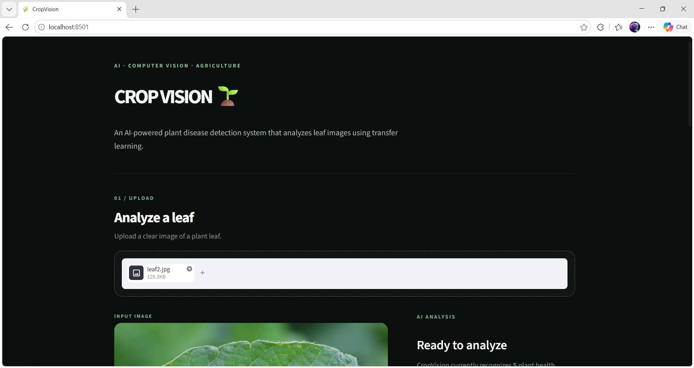

# CropVision 🌱

> AI-powered plant disease classification using MobileNetV2 transfer learning and Grad-CAM explainability.

CropVision analyzes plant leaf images and predicts one of five plant health classes through a Streamlit web application.

---

## Demo

### CropVision Web App



---

## Overview

CropVision is a computer vision project built using **MobileNetV2** transfer learning.

The system takes a leaf image as input and provides:

- Plant health classification
- Model confidence
- Top-3 prediction distribution
- Grad-CAM visual explanation
- Supporting agricultural considerations

The project is designed as an **AI/ML research and demonstration system**.

---

## Key Results

| Metric | Result |
|---|---:|
| Validation Accuracy | **94.52%** |
| Validation Samples | **821** |
| Classes | **5** |
| Backbone | **MobileNetV2** |

The reported validation accuracy comes from evaluation on 821 held-out validation images.

---

## Supported Classes

CropVision currently recognizes:

1. Bell Pepper — Bacterial Spot
2. Bell Pepper — Healthy
3. Potato — Early Blight
4. Potato — Late Blight
5. Potato — Healthy

---

## Model Architecture

```text
Leaf Image
    ↓
Data Augmentation
    ↓
MobileNetV2
    ↓
Global Average Pooling
    ↓
Dropout
    ↓
Dense Softmax Classifier
    ↓
Class Prediction